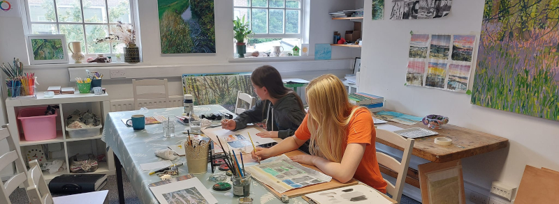

Would you like to reconnect with your creativity? Perhaps you’ve found yourself with a little more time, or you’re looking to rediscover a part of yourself that’s been set aside.

Many people carry the belief that they can’t draw or paint, often shaped by something they were told years ago. It’s a story I hear often—and one that can be gently let go. In its place, there’s an opportunity to begin again, with curiosity and openness.

I believe creativity is something we all share. It plays an important role in our sense of self and wellbeing, offering a way to slow down, reflect, and make sense of the world around us. In the midst of busy, often demanding lives, making space for creativity can be both grounding and quietly transformative.

Whether you’re completely new or returning after time away, these classes provide a supportive and relaxed environment to explore drawing and painting at your own pace. Reawakening a creative interest from the past can be a meaningful way to reconnect with who you are today.

You’re warmly invited to join me in my studio in Dorking and take some time for yourself through art.

{: style="display: block; margin: 0 auto; text-align: center; padding: 20;"}
{: style="margin-top: 50px;" width="600"}

